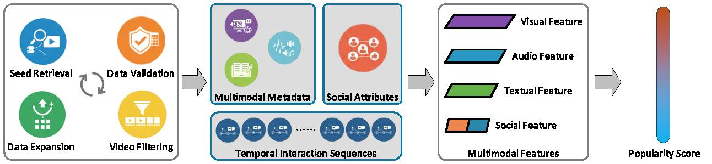

# FPMM

FPMM, the first large-scale public full-process multimodal dataset for social media popularity prediction based on the Sina Weibo platform. The FPMM dataset contains 35,700 videos. For each post, it provides video, audio, text, and social attributes, as well as 24-hour interval temporal interaction sequences across nine time steps, including views, likes, comments, and retweets. In addition, we extract machine-learning-ready multimodal features and propose a composite popularity metric through a weighted aggregation mechanism that integrates both coverage and engagement. Benchmark experiments on eight representative predictors verify the nontrivial challenges of the FPMM dataset. As a novel full-process multimodal dataset, it fills the gaps in existing resources and supports further research on social media popularity prediction.

The subset of FPMM dataset is available for download at https://pan.baidu.com/s/1GqGbLbARMmMi0imc5qWE9w?pwd=FPMM

The complete version of FPMM dataset is uploading ... ...
